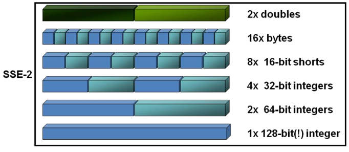
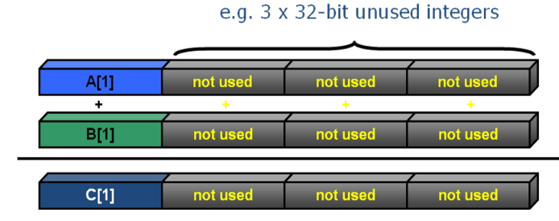
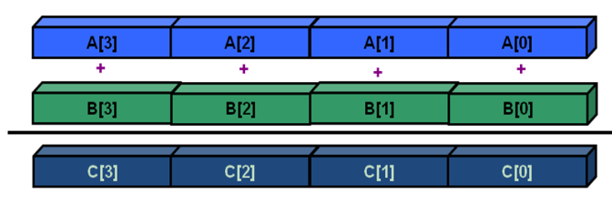

name: title-slide
class: center, middle, inverse
layout: true
---
name: section-slide
class: left, middle, inverse
layout: true
---
name: default
class: left, top
layout: true
---
name: title
template: title-slide

Using SSE and AVX intrinsics
===========================
<p>&nbsp;</p>
To write fast codes
-----------------------------
<p>&nbsp;</p>
Davoud Saffar, 2014-12-21

.footnote[
Navigate with arrow keys&nbsp;&nbsp;<-&nbsp;&nbsp;->]
---
## Outline

* Introduction
* Compiler Vectorization
* SSE
* AVX

---
## Introduction
* Vectorization: Loop unrolling + SIMD instructions
* Auto Vectorization: 
  * Enable: -O2 or higher

---
## Loop Unrolling
```C
int sum_no_unrolling( int n, int *a ){
   int sum = 0;
   for( int i = 0; i < n; i++ )
       sum += a[i];
   return sum;
}
```
```C
int sum_unrolled( int n, int *a ){
   int sum = 0;
   for( int i = 0; i < n/4*4; i += 4 )
      {
        sum += a[i+0];
        sum += a[i+1];
        sum += a[i+2];
        sum += a[i+3];
       }
    for( int i = n/4*4; i < n; i++ )   
       sum += a[i];

    return sum;
}
```
---
## SSE Instructions
* Check capability of the CPU
  * on linux: cat /proc/cpuinfo | grep 'sse*'
  * on mac:   sysctl machdep.cpu.features

<center>

</center>

*navie.c*
```C
for(i=0;i<=MAX;i++)
  c[i]=a[i]+b[i];
```

---
## SSE Instructions
* Without SSE
<center>

</center>

* With SSE
<center>

</center>
* courtesy Intel

---
## Types and Instructions
* Add 
```C
#include emmintrin.h
```

**Data Types**
* __m128i
* __m128  = {float f3, f2, f1, f0}
* __m128d = {double d1, d0}

**Memory Allocation**
* _mm_malloc(a,16)
* _mm_free(a)

---
## Types and Instructions
**Load and store**
* _mm_load_px
* _mm_loadu_px
* _mm_store_px
* _mm_storeu_px

**Arithmatic**
* _mm_add_px
* _mm_mul_px
* _mm_sub_px
* _mm_div_px

**Other**
* _mm_setzero_px
* _mm_set1_px

---
## Apply to sample code
*navie.c*
```C
for(i=0;i<=MAX;i++)
  c[i]=a[i]+b[i];
```
*sse_inst.c*
```C
double *a = _mm_malloc(MAX,16);
double *b = _mm_malloc(MAX,16);
double *c = _mm_malloc(MAX,16);

__m128d sA, sB, sC;
for(i=0;i<=MAX;i+=2)
{
  sA = _mm_load_pd( a+i );
  sB = _mm_load_pd( b+i );
  sC = _mm_add_pd( sA, sB );
  _mm_store_pd( c+i , sC );
}
```

---
# AVX Instructions
```C
include <x86intrin.h>
```

* __m256x
* _mm256_add_pd

*navie.c*
```C
for(i=0;i<=MAX;i++)
  c[i]=a[i]+b[i];
```

*avx_inst.c*
```C
double *a = _mm_malloc(MAX,32);
double *b = _mm_malloc(MAX,32);
double *c = _mm_malloc(MAX,32);

__m256d sA, sB, sC;
for(i=0;i<=MAX;i+=4)
{
  sA = _mm256_load_pd( a+i );
  sB = _mm256_load_pd( b+i );
  sC = _mm256_add_pd( sA, sB );
  _mm256_store_pd( c+i , sC );
}
```

---
## Compiler flags
* At least -O2
* -msse, -mavx

```bash
$ gcc -Wall -O3 -msse -o name name.c
```

### Further readings
* SSE and AVX. 
[https://software.intel.com/sites/landingpage/IntrinsicsGuide/](https://software.intel.com/sites/landingpage/IntrinsicsGuide/)

* SSE Data Types. 
[http://msdn.microsoft.com/en-us/library/cc953fe1%28v=vs.90%29.aspx](http://msdn.microsoft.com/en-us/library/cc953fe1%28v=vs.90%29.aspx)

* Arithmatic Operations. 
[http://msdn.microsoft.com/en-us/library/4atda1f2%28v=vs.90%29.aspx](http://msdn.microsoft.com/en-us/library/4atda1f2%28v=vs.90%29.aspx)
